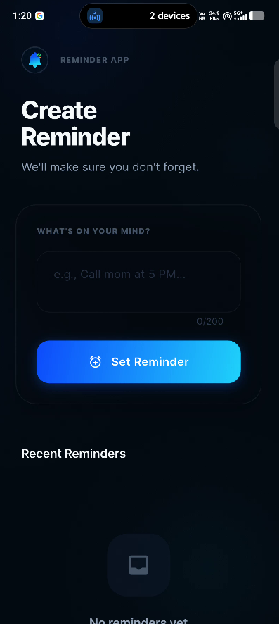
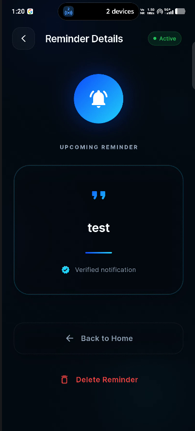

# Reminder App 🔔
### Built for a cross-platform mobile developer assessment focused on notifications, lifecycle handling, and deep linking.

A modern, minimal, and production-focused cross-platform Reminder Application built with Flutter.

The project was designed to demonstrate:
- real device notification handling
- background scheduling
- app lifecycle management
- deep linking/navigation flow
- polished mobile UI/UX

The application focuses on reliability, smooth user experience, and production-style mobile architecture.

---

# ✨ Features

- Real Device Notifications using `flutter_local_notifications`
- Scheduled Reminder Notifications after 30 seconds
- Works Even When App Is Killed
- Notification Tap Navigation
- Recent Reminders History
- Reminder Details Screen
- Delete Reminder Functionality
- Modern Dark UI
- Glassmorphism-based Design
- Smooth Micro-interactions & Animations
- Cross-platform Flutter Architecture

---

# 📸 Screenshots

## Home Screen



---

## Reminder Details Screen



---

# 🛠 Tech Stack

| Technology | Purpose |
|---|---|
| Flutter | Cross-platform app development |
| Dart | Programming language |
| flutter_local_notifications | Local notifications |
| timezone | Scheduled notifications |
| shared_preferences | Local reminder storage |
| google_fonts | Typography system |

---

# 🧠 Architecture

The application follows a lightweight service-oriented architecture.

## Core Structure

- `NotificationService`
  - Handles notification scheduling
  - Background notification delivery
  - Notification payload handling
  - App lifecycle integration

- `StorageService`
  - Handles persistent reminder storage
  - Saves recent reminders locally

- `Reminder Model`
  - Structured reminder data handling

- `navigatorKey`
  - Used for deep linking/navigation from notification callbacks

This structure keeps the application clean, scalable, and maintainable while remaining lightweight for the assessment scope.

---

# 📂 Folder Structure

```bash
lib/
├── models/           # Reminder data models
├── screens/          # UI screens
├── services/         # Notifications & storage logic
├── theme/            # App theme & colors
├── widgets/          # Reusable UI components
└── main.dart         # App entry point
```

---

# ⚡ Why Flutter

Flutter was chosen because it enables:
- Cross-platform Android/iOS development
- Native-like performance
- Rapid UI iteration
- Strong notification ecosystem
- Consistent UI implementation across platforms

---

# 🚀 Getting Started

## Prerequisites

- Flutter SDK (Stable)
- Android Studio / VS Code
- Physical Android device recommended for notification testing

---

## Installation

### 1. Clone the repository

```bash
git clone https://github.com/jainam-15/reminder-app.git
cd reminder-app
```

### 2. Install dependencies

```bash
flutter pub get
```

### 3. Run the application

```bash
flutter run
```

---

# 📦 Build APK

```bash
flutter build apk --release
```

Generated APK location:

```bash
build/app/outputs/flutter-apk/app-release.apk
```

---

# 📱 Notification Testing Flow

### 1. Open the application

Launch the app and wait for the splash screen.

### 2. Create a reminder

Enter a reminder message and tap:

```text
Set Reminder
```

### 3. Immediate notification

A real device notification appears instantly:

```text
Reminder Set
```

### 4. Close the app

Completely remove the application from recent apps.

### 5. Wait 30 seconds

A second notification appears:

```text
You have a reminder. Click to view it.
```

### 6. Tap the notification

The app reopens directly into the:

```text
Reminder Details Screen
```

with the exact reminder message.

---

# 🤖 Platform Specifics

## Android

- Uses dedicated monochrome notification icons
- Supports Android 13+ notification permissions
- Handles scheduled notifications using OS-level scheduling
- Adaptive launcher icons configured

---

## iOS

- iOS-compatible Flutter architecture included
- Darwin notification configuration supported
- Supports iOS lifecycle handling

> Note:
> iOS deployment requires macOS + Xcode for code signing and deployment to physical devices.

---

# 🎨 Design Philosophy

The application follows a modern dark aesthetic inspired by productivity and fintech applications.

## Design Principles

- Minimal UI
- Strong typography hierarchy
- Glassmorphism surfaces
- Atmospheric depth & glow layers
- Smooth animations
- Production-style mobile UX

The goal was to create a clean and intentional mobile experience rather than relying on generic templates.

---

# 🎯 Project Goals

This project was built to demonstrate:

- Notification implementation
- Background processing capability
- App lifecycle handling
- Notification payload navigation
- Cross-platform mobile development
- Production-quality Flutter UI implementation

---

# 📹 Demo Submission

The submission package includes:

- Android APK
- Screen recording/demo walkthrough
- Source code repository
- README documentation

---

# 👨‍💻 Author

Developed by Jainam Shah as part of a cross-platform mobile developer assessment.